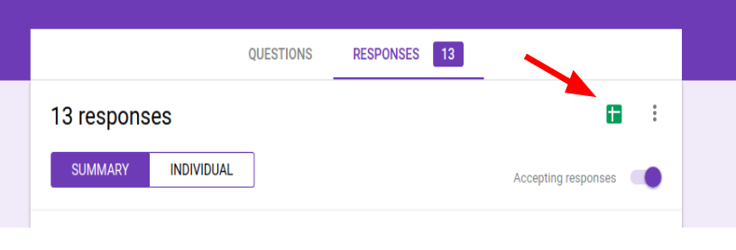

# A) How to run the objective result generation
.bag files are automatically generated here after each run of the system. It tracks the topic ´/task_manager/task_status´
The auto created files named with the format: ´tests_<date-and-time>.bag´. The initial name ´tests´ is defined manually under ´hrc.launch´ line 15. Change the name at the end of the argument path to indicate different experiments.

## Creating .csv files

In the ´task_status´ topic there are 5 agents reporting separately: *MANAGER, HUMAN, ROBOT, OBSERVATION, SENSORS*
Run first below to safely convert .bag file to .csv

```sh
python bag_to_csv.py <name_of_the_bag_file.bag>
```

This creates a folder with the same name of the .bag file. Repeat this step with all participants, then 

- Copy the result files of each participant into an analysis folder and rename it to your taste (in the following example ```./Participants/Analysis/task_success_files/``` is used as the analysis directory)

- We can now start with our analysis as described below


## Analyze the .csv files in ./Participants/Analysis/task_success_files 

### Mean and standarddeviation plots & compile filtered result files 
We can now analyze and plot the objective characteristics of the challenging tasks. For this purpose the script ```IntExperiment_update_sensor_data.py``` can be used. 
It provides different methods that can be called from the terminal directly. 
- plot_challenging: 
    - Averages over all .csv files that are found in the directory supplied (```./Participants/Analysis/task_success_files```)
    - calculates and plots mean and standardeviation over these .csv files for  rewards, task_duration, # of robot interference and warnings. The success_rate is compiled and saved as a new .csv file called ```./Participants/Analysis/TaskSummary_with_successrate.csv``` and needs to be analyzed manually.
    - Compiles a more compact results file that only includes the objective measures that are also analyzed. The file is written to ```./Participants/AnalysisTaskSummary_with_successrate.csv```
    - Generates mean and standard deviation plots (using matplotlib). The plots are saved to ```./Participants/Analysis/Challenging_task_plots```. They include: rewards, robot_interventions, task_duration and warnings 

```sh
python IntExperiment_update_sensor_data.py <folder where result files are stored (all in one directory)> plot_challenging bool_debug bool_show_plots

e.g. use like this to show debug messages and show plots and analyze result files found in './Participants/Analysis/task_success_files/'

python IntExperiment_update_sensor_data.py ./Participants/Analysis/task_success_files plot_challenging 1 1
```

Note: The two trailing boolean flags are used to control whether debug messages as well as the plots should directly be shown after running the script. The plots will be created in any case and can also be inspected manually. This is achieved by setting the boll_show_plots to 0 and then manually opening the plots in the folder ```./Participants/Analysis/Challenging_task_plots```

### Statistical analysis (ANOVA and T-Test)

The statistical analysis is based on the filtered result file (```./Participants/AnalysisTaskSummary_with_successrate.csv```) that is generated by the ```IntExperiment_update_sensor_data.py``` script (see step above). The naming convention of the columns of the filtered result file is as follows: 

    ttype<#tasktype>_<measure>     e.g. ttype1_duration   means the task duration for task type 1
    for task types that are present more than once the columns are named as follows ttype<#tasktype #roundinexperiment>_<measure>  => ttype23_warnings describes the warnings received during round 3, which was a type2 task. In the first interaction experiment (master thesis) the first occurances for each task type have been used for the analysis only. Those are ttype1, ttype23, ttype47.  

The results have been statistically analyzed with the Software Jamovi in version 1.0.0.0  (https://www.jamovi.org/). Specifically the ANOVA analysis, Pos-hoc T-tests, and T-test have been used to find statistically significant differences of measures between the different task types. The relevant values have been manually copied to a Jamovi sheet (separate sheet for each measure) and an ANOVA and Post-hoc analysis has been executed. Have a look here, on how to use Jamovi for statistical analyses https://www.jamovi.org/user-manual.html#analyses

- Copy one measure for all tasktype groups that should be compared into a Jamovi spreadsheet 
- Execute an ANOVA analysis with significance level 0.05 
- If the result is significant (p< 0.05) execute a post hoc tukey T-test to identify the exact groups that differ significantly 
- If the ANOVA results are not significant, then identify the groups, whose means differ the most and execute a Paired samples T-test to see if those groups differ significantly from each other 
- An ->Exploration->Descriptives  analysis can also help to get an ever better understanding of the data. E.g. boxplots, histograms ... 
- The results and plots can be saved as a .pdf file. 
- To compile a nicer looking results file for reports, papers ... you can use open office draw. You can open the .PDF file with it and move plots, add text, delete plots that are not needed ... It worked best to adjust the canvas size to the final document and save the result as a new .pdf that can then be included into your paper. Best results were obtained by using 1page .pdf documents only and adjust the canvas size of the .pdf, so that all plots that should be included perfectly fit on this one page. 

-------
-------


# B) How to analyze survey results  
After you collected all your survey results in google forms you can link them to a spreadsheet like shown with the red arrow below. 
Download the spreadsheet afterwards. 



## Analyze means and standard deviation 

The means and standard deviation has been analyzed and plotted with libre office calc. The following procedure has been used: 
- Make a working copy of the downloaded survey result file 
- Make a separate tab for each measures/question that should be analyzed and copy (by reference) the measure for all tasktypes that should be compared. (e.g. ttype1_warning, ttype23_warning, ttype47_warning)
- Calculate means and standard deviation and plot them afterwards (e.g. bar plot with error bars)
- For high quality plots, it works best to save the plots as vector graphics in .svg format. They need to be manually converted to .pdf files to include them in most text processing tools. This can be done like this ```inkscape input.svg --export-pdf=export.pdf```

## Statistical analysis (ANOVA and T-test)

The statistical analysis is based on the Work version of the survey results files as described in the step above.

The results have been statistically analyzed with the Software Jamovi in version 1.0.0.0  (https://www.jamovi.org/). Specifically the ANOVA analysis, Pos-hoc T-tests, and T-test have been used to find statistically significant differences of measures between the different task types. The relevant values have been manually copied to a Jamovi sheet (separate sheet for each measure) and an ANOVA and Post-hoc analysis has been executed. Have a look here, on how to use Jamovi for statistical analyses https://www.jamovi.org/user-manual.html#analyses

- Copy one measure for all tasktype groups that should be compared into a Jamovi spreadsheet 
- Execute an ANOVA analysis with significance level 0.05 
- If the result is significant (p< 0.05) execute a post hoc tukey T-test to identify the exact groups that differ significantly 
- If the ANOVA results are not significant, then identify the groups, whose means differ the most and execute a Paired samples T-test to see if those groups differ significantly from each other 
- An ->Exploration->Descriptives  analysis can also help to get an ever better understanding of the data. E.g. boxplots, histograms ... 
- The results and plots can be saved as a .pdf file. 
- To compile a nicer looking results file for reports, papers ... you can use open office draw. You can open the .PDF file with it and move plots, add text, delete plots that are not needed ... It worked best to adjust the canvas size to the final document and save the result as a new .pdf that can then be included into your paper. Best results were obtained by using 1page .pdf documents only and adjust the canvas size of the .pdf, so that all plots that should be included perfectly fit on this one page. 

## NASA-TLX task load analysis 

The NASA task load index (NASA-TLX) is used to measure the difficulty of the task in different dimensions. It is a very well established tool to generically analyze the task load of a given task in 6 different dimensions (mental demand, physical demand, temporal demand, overall performance, effort, frustration level). It also allows to compare the task load of tasks from completely different areas between another. We analyzed the overall NASA-TLX and also inspected the mental demand more closely. 

NOTE: In the earliest version of the NASA-TLX the analysis includes a weighting step where participants can weight which dimension of the task load is most important to them. In later studies a lot of authors criticized this step and suggested to directly use the reported values without an extra weighting step. This direct approach has also been used here. 

The following analysis is based on the work version of the survey results files as described in the step above. 

- Create a new tab and copy and group the participant's responses to the new tab. The structure should be as follows  |ttyp1_participant_1|ttype2_participant_2| ....|ttype2_participant_1| ... 
- Calculate the sum of responses for each of the 6 dimensions 
- Calculate the Average over the 6 Sums to get the overall NASA-TLX score

